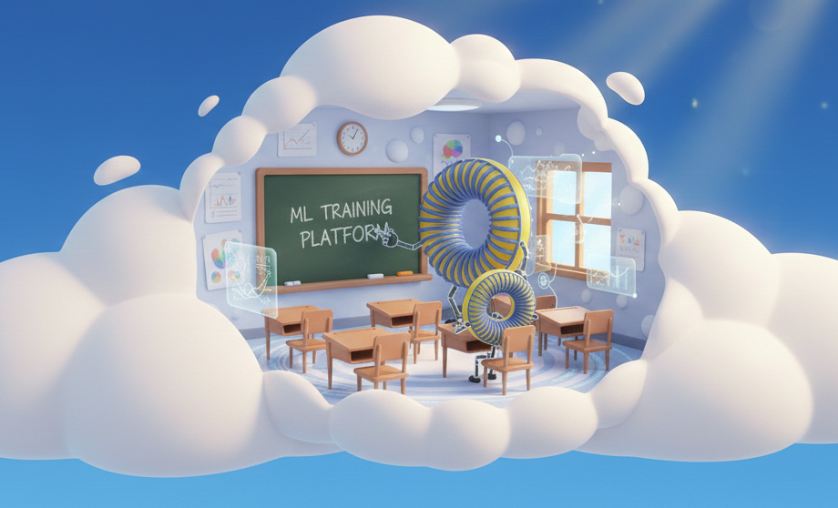
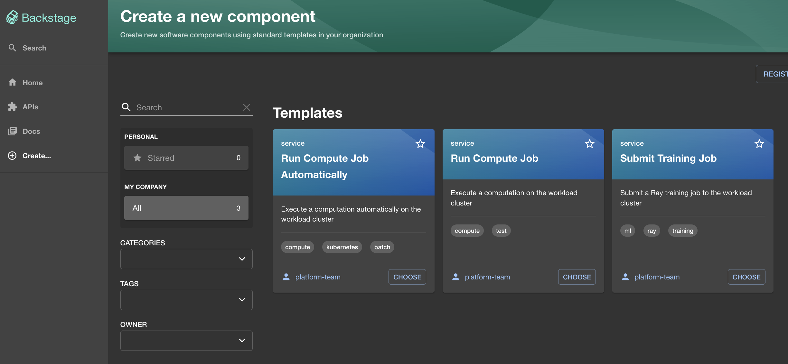
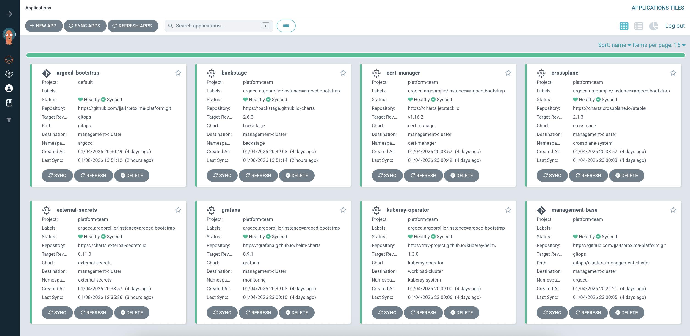

# GCP Proxima Fusion ML Training Platform

# 

Platform for distributed ML training on GCP with Kubernetes and Ray.

## 🚀 High Level Quick Start

### 1. Deploy Platform (Infrastructure)
The platform uses a **Dual-Cluster GitOps Architecture**:
- **Management Cluster**: Runs ArgoCD, Backstage, Monitoring.
- **Workload Cluster**: Runs Ray training jobs.

```bash
# 1. Open in VS Code Dev Container (Tools pre-installed)

# 2. Deploy Infrastructure & Bootstrap GitOps
cd terraform/envs/dev
# Set your project_id in terraform.tfvars
terraform init
terraform apply
```
*ArgoCD will automatically hydrate the clusters with applications (Grafana, Ray Operator, Backstage, etc.)*

### 2. Submit Training Jobs
Once deployed, you need to **build** the workload image before submitting it to the **Workload Cluster**.

```bash
# 1. Connect to Clusters
gcloud container clusters get-credentials ml-platform-workload  --region europe-west3

# 2. Build & Push Image
ml-platform build stellar_optimization v1.0.0

# 3. Submit Job
ml-platform submit stellar_optimization:v1.0.0
```

See **[docs/QUICKSTART.md](docs/QUICKSTART.md)** for the complete guide.

## 🏗️ Architecture

The platform follows a strict separation of concerns using two GKE clusters managed by ArgoCD.

```
┌─────────────────────────────────────────────────────────────┐
│  Google Cloud Platform                                      │
│                                                             │
│  ┌─────────────────────────────┐  ┌──────────────────────┐  │
│  │  Management Cluster         │  │  Workload Cluster    │  │
│  │  (Platform Services)        │  │  (Compute Resources) │  │
│  │                             │  │                      │  │
│  │  ┌────────┐  ┌───────────┐  │  │  ┌───────────┐       │  │
│  │  │ ArgoCD │  │ Backstage │  │  │  │ Ray Op.   │       │  │
│  │  └────────┘  └───────────┘  │  │  └───────────┘       │  │
│  │                             │  │                      │  │
│  │  ┌────────┐  ┌───────────┐  │  │  ┌───────────┐       │  │
│  │  │Grafana │  │Crossplane │──┼──┼─►│ Ray Clstr │       │  │
│  │  └────────┘  └───────────┘  │  │  └───────────┘       │  │
│  └─────────────────────────────┘  └──────────────────────┘  │
│              ▲                                              │
└──────────────┼──────────────────────────────────────────────┘
               │ (Syncs State)
   ┌───────────┴──────────┐
   │  GitOps Repository   │
   │      (github)        │
   └──────────────────────┘
```

### Components
- **GitOps (`/gitops`)**: ArgoCD manages all cluster state.
- **Backstage**: Developer portal for creating and viewing jobs.
- **Ray**: Distributed training framework running on the Workload Cluster.
- **Crossplane**: Manages cloud resources (GCP buckets, SAs) from K8s.

## 📁 Project Structure

```
proxima-platform/
├── .devcontainer/          # 🐳 VS Code dev container config
├── docs/                   # 📚 Documentation & Examples
├── gitops/                 # ☸️  Source of Truth (ArgoCD Apps)
│   ├── apps/               # Backstage (Internal Developer Portal), Grafana, KubeRay
│   ├── argocd/             # Bootstrap configuration
│   ├── clusters/           # Cluster-specific configs
│   ├── infrastructure/     # Crossplane, Cert-Manager
│   └── security/           # RBAC & Policies
├── kubernetes/             # 📦 Raw manifests
├── ml_platform/            # 🐍 Python CLI & SDK
│   ├── cli/                # 'ml-platform' command tool
│   └── sdk/                # Python client for jobs
├── scripts/                # 🛠 Helper scripts
└── terraform/              # ☁️  Base Infrastructure
    ├── envs/dev/           # Deployment entrypoint
    └── modules/            # Reusable modules
```


## 🛠 CLI Installation

The `ml-platform` CLI is used by engineers and scientists to interact with the **Workload Cluster**.

### Recommended: UV
```bash
uv sync
source .venv/bin/activate
ml-platform status
```


## 🎮 CLI Commands 
> **Note:** Ensure you are connected to the **Workload Cluster** (`kubectl config use-context workload`)

```bash
ml-platform status                           # Show ml-platform health
ml-platform build <workload> <version>       # Build and push container
ml-platform submit <workload>:<version>      # Submit training job
ml-platform logs <job-name>                  # View job logs
ml-platform list                             # List all jobs
ml-platform scale <replicas>                 # Scale Ray workers
ml-platform port-forward [ray|grafana|all]   # Access dashboards
```

### Examples

```bash
# Build workload
ml-platform build stellar_optimization v1.0.0

# Submit job
ml-platform submit stellar_optimization:v1.0.0

# Monitor
ml-platform logs stellar-optimization-20251201-120000

# Scale Ray cluster
ml-platform scale 20

# Access dashboards
ml-platform port-forward ray      # Ray: http://localhost:8265
ml-platform port-forward grafana  # Grafana: http://localhost:3000
ml-platform port-forward all      # All dashboards
```

## 🎸 Backstage (Developer Portal)
# 
Backstage is the central portal for viewing jobs, documentation, and services.

**To access Backstage:**
1. Connect to the Management Cluster:
   ```bash
   kubectl config use-context management
   ```
2. Port-forward the service:
   ```bash
   kubectl port-forward -n backstage svc/backstage 7007:7007
   ```
3. Open **http://localhost:7007** in your browser.

## ☸️ GitOps
# 
All cluster state is managed via GitOps (`gitops/` directory).

1. **Modify State**: Edit files in `gitops/` (e.g., `gitops/apps/backstage/application.yaml`).
2. **Commit**: Push changes to the `main` branch.
3. **Sync**: ArgoCD automatically syncs changes to the clusters (usually within 3 minutes).

*Open the ArgoCD UI to monitor:*
```bash
kubectl config use-context management
kubectl port-forward svc/argocd-server -n argocd 8080:443
# Login at https://localhost:8080 (admin / password is a secret)

# Retrieve password:
kubectl -n argocd get secret argocd-initial-admin-secret -o jso
npath='{.data.password}' | base64 --decode && echo ""

```

## 🐍 SDK Usage

```python
from ml_platform.sdk import PlatformClient

# Client automatically connects to current kubecontext (Workload Cluster)
client = PlatformClient(project_id="your-project")

# Submit job
job = client.submit_job(
    name="training",
    image="europe-west3-docker.pkg.dev/project/repo/model:v1",
    cpu="8",
    memory="32Gi"
)
```
## 📚 Documentation

- **[GitOps Guide](docs/GITOPS.md)** - How the dual-cluster architecture works.
- **[Launch Platform](docs/LAUNCH_PLATFORM.md)** - Terraform setup guide.
- **[Developer Guide](docs/DEV_GUIDE.md)** - Testing and contributing.
- **[Example Workload](docs/examples/stellar_optimization/README.md)** - Training a Stellarator fusion model.